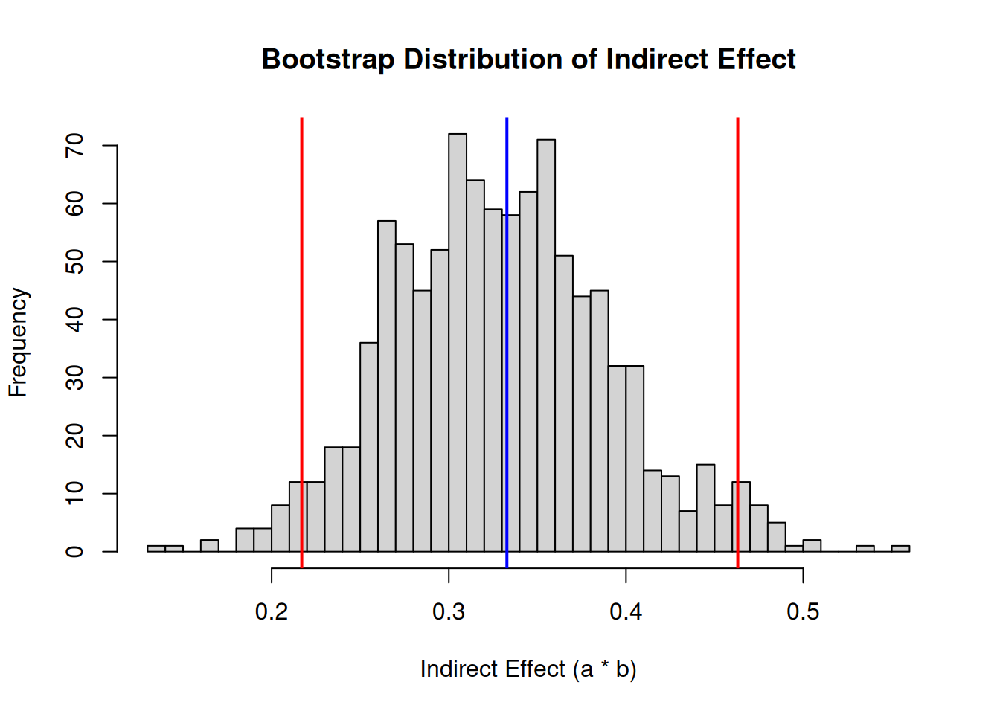
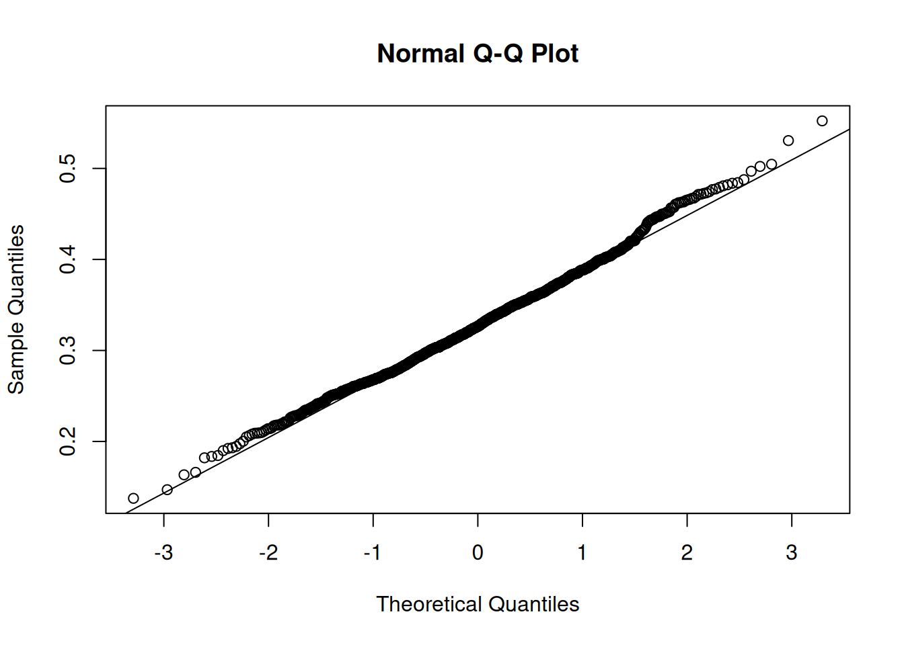

# Bootstrap Inference

## Overview

Bootstrap inference provides confidence intervals for indirect effects
without assuming normality. medfit implements three bootstrap methods:

1.  **Parametric bootstrap**: Sample from parameter distribution (fast,
    assumes normality)
2.  **Nonparametric bootstrap**: Resample data and refit models (robust,
    slower)
3.  **Plugin estimator**: Point estimate only (fastest, no CI)

All methods return a `BootstrapResult` object with consistent structure.

## Example Data

The examples use the bundled, simulated `mediation_demo` data (see
[`?mediation_demo`](https://data-wise.github.io/medfit/reference/mediation_demo.md)):
a randomized `treatment`, mediators `mediator1` and `mediator2`, an
`outcome`, and two mediator-outcome confounders, `covariate1` and
`covariate2`. Every model below adjusts for both covariates.

``` r
library(medfit)
```


    Attaching package: 'medfit'

    The following object is masked from 'package:stats':

        decompose

``` r
data(mediation_demo)
```

## Quick Start: Bootstrap with med()

The easiest way to get bootstrap confidence intervals:

``` r
# One-line bootstrap mediation
result <- med(
  data = mediation_demo,
  treatment = "treatment",
  mediator = "mediator1",
  outcome = "outcome",
  covariates = c("covariate1", "covariate2"),
  boot = TRUE,
  n_boot = 1000,
  seed = 123
)

# Instant results with CI
quick(result)
```

    NIE = 0.333  [0.217, 0.465] | NDE = 0.206 | PM = 61.8 %

``` r
# The BootstrapResult is attached as an attribute (not an S7 property)
attr(result, "bootstrap")
```

    BootstrapResult object
    ======================

    Method:   parametric
    Estimate:   0.3328
    N bootstrap samples: 1000

    95% Confidence Interval:
      Lower:   0.2172
      Upper:   0.4650

For more control over bootstrap methods, use
[`bootstrap_mediation()`](https://data-wise.github.io/medfit/reference/bootstrap_mediation.md)
directly.

## Why Bootstrap for Mediation?

The sampling distribution of indirect effects (\\a \times b\\) is
typically:

- **Non-normal**: Even when a and b are normal, their product is not
- **Skewed**: Often right-skewed
- **Complex**: No closed-form distribution for general case

Bootstrap methods: - Don’t assume normality - Provide accurate coverage
(closer to nominal 95%) - Handle complex indirect effects (serial
mediation, moderated mediation)

## Parametric Bootstrap

Samples from the estimated parameter distribution:

``` r
# Fit mediation models
fit_m <- lm(mediator1 ~ treatment + covariate1 + covariate2, data = mediation_demo)
fit_y <- lm(outcome ~ treatment + mediator1 + covariate1 + covariate2,
            data = mediation_demo)

# Extract mediation structure
med_data <- extract_mediation(
  fit_m,
  model_y = fit_y,
  treatment = "treatment",
  mediator = "mediator1"
)

# Define statistic function for indirect effect
# Parameter names are prefixed by model: m_treatment (mediator model),
# y_mediator1 and y_treatment (outcome model)
indirect_effect <- function(theta) {
  theta["m_treatment"] * theta["y_mediator1"]
}

# Parametric bootstrap
boot_result <- bootstrap_mediation(
  statistic_fn = indirect_effect,
  method = "parametric",
  mediation_data = med_data,
  n_boot = 1000,
  ci_level = 0.95,
  seed = 123
)

print(boot_result)
```

    BootstrapResult object
    ======================

    Method:   parametric
    Estimate:   0.3328
    N bootstrap samples: 1000

    95% Confidence Interval:
      Lower:   0.2170
      Upper:   0.4631

``` r
summary(boot_result)
```

    Summary of BootstrapResult
    ==========================

    Method:    parametric
    Estimate:  0.3327695
    N bootstrap samples: 1000

    95% Confidence Interval:
      Lower: 0.2170026
      Upper: 0.4630625

    Bootstrap Distribution Summary:
       Min. 1st Qu.  Median    Mean 3rd Qu.    Max.
     0.1375  0.2852  0.3264  0.3290  0.3675  0.5522 

### How It Works

1.  Extract parameter estimates: \\\hat{\theta} = (\hat{a}, \hat{b},
    ...)\\
2.  Extract covariance matrix: \\\hat{\Sigma}\\
3.  For each bootstrap iteration \\i = 1, ..., B\\:
    - Sample \\\theta^\*\_i \sim N(\hat{\theta}, \hat{\Sigma})\\
    - Compute indirect effect: \\IE^\*\_i = a^\*\_i \times b^\*\_i\\
4.  Compute percentile CI from bootstrap distribution

### When to Use

- **Fast**: No model refitting required
- **Appropriate when**: Parameters are approximately normal (large n)
- **Inappropriate when**: Small samples, non-normal parameters

### Advantages

- Very fast (no refitting)
- Reproducible with seed
- Works with extracted models (no need for original data)

### Disadvantages

- Assumes multivariate normality of parameters
- May underestimate uncertainty in small samples

## Nonparametric Bootstrap

Resamples data and refits models:

``` r
# Statistic function that refits models on resampled data
statistic_fn_refit <- function(boot_data) {
  # Fit models on bootstrap sample
  fit_m <- lm(mediator1 ~ treatment + covariate1 + covariate2,
              data = boot_data)
  fit_y <- lm(outcome ~ treatment + mediator1 + covariate1 + covariate2,
              data = boot_data)

  # Extract and compute indirect effect
  med_boot <- extract_mediation(fit_m, model_y = fit_y,
                                treatment = "treatment", mediator = "mediator1")
  med_boot@a_path * med_boot@b_path
}

# Nonparametric bootstrap (requires original data)
boot_np <- bootstrap_mediation(
  statistic_fn = statistic_fn_refit,
  method = "nonparametric",
  data = mediation_demo,
  n_boot = 1000,
  ci_level = 0.95,
  seed = 123,
  parallel = TRUE,
  ncores = 4
)

print(boot_np)
```

    BootstrapResult object
    ======================

    Method:   nonparametric
    Estimate:   0.3328
    N bootstrap samples: 1000

    95% Confidence Interval:
      Lower:   0.2057
      Upper:   0.4694

### How It Works

1.  For each bootstrap iteration \\i = 1, ..., B\\:
    - Resample data with replacement: \\D^\*\_i\\
    - Refit mediator model on \\D^\*\_i\\
    - Refit outcome model on \\D^\*\_i\\
    - Extract paths: \\a^\*\_i\\, \\b^\*\_i\\
    - Compute indirect effect: \\IE^\*\_i = a^\*\_i \times b^\*\_i\\
2.  Compute percentile CI from bootstrap distribution

### When to Use

- **Robust**: Makes no parametric assumptions
- **Appropriate when**: Small samples, non-normal data, GLMs
- **Gold standard**: Most widely accepted method

### Advantages

- No distributional assumptions
- Robust to outliers
- Captures full sampling variability

### Disadvantages

- Computationally intensive (refits models B times)
- Requires original data
- Can be slow for complex models

### Parallel Processing

Speed up with parallel processing:

``` r
# Detect available cores
ncores <- parallel::detectCores() - 1

# Run in parallel
boot_np_par <- bootstrap_mediation(
  statistic_fn = statistic_fn_refit,
  method = "nonparametric",
  data = mediation_demo,
  n_boot = 5000,
  parallel = TRUE,
  ncores = ncores,
  seed = 123
)
```

## Plugin Estimator

Point estimate only, no confidence interval:

``` r
# Plugin estimator (fastest)
plugin_result <- bootstrap_mediation(
  statistic_fn = indirect_effect,
  method = "plugin",
  mediation_data = med_data
)

print(plugin_result)
```

    BootstrapResult object
    ======================

    Method:   plugin
    Estimate:   0.3328

    (No confidence interval for plugin method)

### When to Use

- Quick checks
- Point estimates for simulation studies
- When CI is not needed

### How It Works

Simply computes \\\hat{a} \times \hat{b}\\ from the fitted model. No
resampling.

## Interpreting Results

### Bootstrap Distribution

The bootstrap distribution shows the sampling variability:

``` r
# Access bootstrap estimates (parametric bootstrap from above)
boot_estimates <- boot_result@boot_estimates

# Histogram
hist(
  boot_estimates,
  breaks = 50,
  main = "Bootstrap Distribution of Indirect Effect",
  xlab = "Indirect Effect (a * b)"
)

# Add percentile CI
abline(v = boot_result@ci_lower, col = "red", lwd = 2)
abline(v = boot_result@ci_upper, col = "red", lwd = 2)
abline(v = boot_result@estimate, col = "blue", lwd = 2)
```



``` r
# Check for normality
qqnorm(boot_estimates)
qqline(boot_estimates)
```



### Confidence Interval

The percentile bootstrap CI is computed as:

- Lower bound: 2.5th percentile (for 95% CI)
- Upper bound: 97.5th percentile (for 95% CI)

``` r
# 95% CI
c(boot_result@ci_lower, boot_result@ci_upper)
```

    [1] 0.2170026 0.4630625

``` r
# Change confidence level
boot_90 <- bootstrap_mediation(
  statistic_fn = indirect_effect,
  method = "parametric",
  mediation_data = med_data,
  n_boot = 1000,
  ci_level = 0.90,
  seed = 123
)
c(boot_90@ci_lower, boot_90@ci_upper) # Narrower
```

    [1] 0.2345624 0.4418077

### Statistical Significance

If the confidence interval excludes zero, the indirect effect is
statistically significant:

``` r
# Check if CI excludes zero
if (boot_result@ci_lower > 0 || boot_result@ci_upper < 0) {
  print("Indirect effect is statistically significant")
} else {
  print("Indirect effect is not statistically significant")
}
```

    [1] "Indirect effect is statistically significant"

## Serial Mediation Bootstrap

For serial mediation (treatment -\> mediator1 -\> mediator2 -\>
outcome), the indirect effect is the product of the chain’s paths, \\a
\times d \times b\\. The parametric and plugin methods accept a
`SerialMediationData` object (and `ParallelMediationData`,
`InteractionMediationData`, or `JointMediationData`) as well as
`MediationData`. `statistic_fn` receives the named `@estimates` vector,
which carries the chain’s path aliases `a`, `d1`, `b`, and `c_prime`:

``` r
# Fit the chain: each model adjusts for the covariates and every upstream
# variable, so the outcome model includes mediator1 as well as mediator2
fit_serial <- function(d) {
  extract_mediation(
    lm(mediator1 ~ treatment + covariate1 + covariate2, data = d),
    model_y = lm(outcome ~ treatment + mediator1 + mediator2 +
                   covariate1 + covariate2, data = d),
    treatment = "treatment",
    mediator = c("mediator1", "mediator2"),
    mediator_models = list(
      lm(mediator2 ~ treatment + mediator1 + covariate1 + covariate2, data = d)
    )
  )
}
serial_med <- fit_serial(mediation_demo)

# Point estimate of the serial indirect effect (a * d * b)
serial_med@a_path * serial_med@d_path * serial_med@b_path
```

    [1] 0.07545039

``` r
# Parametric bootstrap: draw the chain's paths from N(estimates, vcov)
boot_serial_param <- bootstrap_mediation(
  statistic_fn = function(theta) unname(theta["a"] * theta["d1"] * theta["b"]),
  method = "parametric",
  mediation_data = serial_med,
  n_boot = 1000,
  seed = 123
)

print(boot_serial_param)
```

    BootstrapResult object
    ======================

    Method:   parametric
    Estimate:   0.0755
    N bootstrap samples: 1000

    95% Confidence Interval:
      Lower:   0.0371
      Upper:   0.1248

The lm chain above estimates each equation separately, so its covariance
matrix sets the covariances between equations to zero (see the Model
Extraction article). To avoid that assumption, bootstrap
nonparametrically by resampling the data and refitting all three models:

``` r
boot_serial <- bootstrap_mediation(
  statistic_fn = function(boot_data) {
    s <- fit_serial(boot_data)
    s@a_path * s@d_path * s@b_path
  },
  method = "nonparametric",
  data = mediation_demo,
  n_boot = 1000,
  ci_level = 0.95,
  seed = 123
)

print(boot_serial)
```

    BootstrapResult object
    ======================

    Method:   nonparametric
    Estimate:   0.0755
    N bootstrap samples: 1000

    95% Confidence Interval:
      Lower:   0.0383
      Upper:   0.1187

## Reproducibility

Set a seed for reproducible results:

``` r
# Same seed = same results
boot1 <- bootstrap_mediation(
  statistic_fn = indirect_effect,
  method = "parametric",
  mediation_data = med_data,
  n_boot = 1000,
  seed = 123
)
boot2 <- bootstrap_mediation(
  statistic_fn = indirect_effect,
  method = "parametric",
  mediation_data = med_data,
  n_boot = 1000,
  seed = 123
)

# Identical results
identical(boot1@boot_estimates, boot2@boot_estimates)
```

    [1] TRUE

``` r
# Different seed = different results
boot3 <- bootstrap_mediation(
  statistic_fn = indirect_effect,
  method = "parametric",
  mediation_data = med_data,
  n_boot = 1000,
  seed = 456
)
identical(boot1@boot_estimates, boot3@boot_estimates)
```

    [1] FALSE

## How Many Bootstrap Samples?

General guidelines:

- **Exploratory**: 1000 samples (fast)
- **Publication**: 5000+ samples (stable CI)
- **High stakes**: 10,000+ samples (very stable)

Check stability by varying `n_boot`:

``` r
# Compare different n_boot
boot_1k <- bootstrap_mediation(
  statistic_fn = indirect_effect,
  method = "parametric",
  mediation_data = med_data,
  n_boot = 1000,
  seed = 123
)
boot_5k <- bootstrap_mediation(
  statistic_fn = indirect_effect,
  method = "parametric",
  mediation_data = med_data,
  n_boot = 5000,
  seed = 123
)
boot_10k <- bootstrap_mediation(
  statistic_fn = indirect_effect,
  method = "parametric",
  mediation_data = med_data,
  n_boot = 10000,
  seed = 123
)

# Compare CIs
rbind(
  "1K" = c(boot_1k@ci_lower, boot_1k@ci_upper),
  "5K" = c(boot_5k@ci_lower, boot_5k@ci_upper),
  "10K" = c(boot_10k@ci_lower, boot_10k@ci_upper)
)
```

             [,1]      [,2]
    1K  0.2170026 0.4630625
    5K  0.2136351 0.4654500
    10K 0.2132389 0.4661655

If CIs are similar, n_boot is sufficient.

## Alternative CI Methods

medfit currently uses **percentile bootstrap** (simplest, most common).

Future versions may add:

- **BCa (bias-corrected and accelerated)**: Adjusts for bias and
  skewness
- **Studentized bootstrap**: Better coverage in some cases
- **Bayesian bootstrap**: Posterior intervals

## Comparison with Delta Method

The delta method provides asymptotic SE for indirect effects:

`confint(parm = "effects")` computes it over the full `@vcov` (for this
model `Cov(a, b)` is exactly zero, as the outcome equation contains
every regressor of the mediator equation):

``` r
# Delta-method 95% CI for the NIE (assumes normality; warns about it)
ci_delta <- confint(med_data, parm = "effects")["nie", ]
```

    Warning: Normal approximation for NIE may be inaccurate. Consider
    bootstrap_mediation() for robust inference.

``` r
# Compare with bootstrap
ci_boot <- c(boot_result@ci_lower, boot_result@ci_upper)

rbind(delta = ci_delta, bootstrap = ci_boot)
```

                  2.5 %    97.5 %
    delta     0.2063564 0.4591826
    bootstrap 0.2170026 0.4630625

Bootstrap is generally preferred because it: - Doesn’t assume normality
of indirect effect - Handles skewness correctly - Provides better
coverage

## Best Practices

1.  **Choose method appropriately**:

    - Parametric: Large samples, normal data
    - Nonparametric: Small samples, non-normal data, GLMs
    - Plugin: Quick checks only

2.  **Set seed**: Always set seed for reproducibility

3.  **Use enough bootstraps**: At least 1000, preferably 5000+

4.  **Check convergence**: Ensure models converged on bootstrap samples

5.  **Visualize distribution**: Plot histogram and Q-Q plot

6.  **Use parallel processing**: For nonparametric with large B

## Next Steps

- See
  [introduction](https://data-wise.github.io/medfit/articles/introduction.md)
  for S7 class details
- Learn about [model
  extraction](https://data-wise.github.io/medfit/articles/extraction.md)
- Check reference documentation for
  [`bootstrap_mediation()`](https://data-wise.github.io/medfit/reference/bootstrap_mediation.md)

## Working with Bootstrap Results

### Tidyverse Integration

``` r
library(generics)
```


    Attaching package: 'generics'

    The following objects are masked from 'package:base':

        as.difftime, as.factor, as.ordered, intersect, is.element, setdiff,
        setequal, union

``` r
# Convert to tibble
tidy(boot_result)
```

    # A tibble: 1 × 5
      term     estimate std.error conf.low conf.high
      <chr>       <dbl>     <dbl>    <dbl>     <dbl>
    1 estimate    0.333    0.0612    0.217     0.463

``` r
# One-row summary
glance(boot_result)
```

    # A tibble: 1 × 4
      estimate ci_level method     n_boot
         <dbl>    <dbl> <chr>       <int>
    1    0.333     0.95 parametric   1000

### Accessing Results Directly

[`coef()`](https://rdrr.io/r/stats/coef.html) and
[`confint()`](https://rdrr.io/r/stats/confint.html) work on a
`BootstrapResult`, and its properties can be read directly:

``` r
# Point estimate
coef(boot_result)
```

     estimate
    0.3327695 

``` r
boot_result@estimate
```

    m_treatment
      0.3327695 

``` r
# Stored percentile interval
confint(boot_result)
```

                 2.5 %    97.5 %
    estimate 0.2170026 0.4630625

``` r
c(lower = boot_result@ci_lower, upper = boot_result@ci_upper)
```

        lower     upper
    0.2170026 0.4630625 

``` r
# A different level is recomputed from the stored bootstrap draws
confint(boot_result, level = 0.90)
```

                   5 %      95 %
    estimate 0.2345624 0.4418077

## Development Status

Bootstrap infrastructure is **complete**:

- ✅ S7 class for BootstrapResult
- ✅ Parametric bootstrap
- ✅ Nonparametric bootstrap
- ✅ Plugin estimator
- ✅ Parallel processing support
- ✅ Seed-based reproducibility
- ✅ Integration with
  [`med()`](https://data-wise.github.io/medfit/reference/med.md) via
  `boot = TRUE`
- ✅ Tidyverse methods (tidy, glance)
- ✅ Base R methods ([`coef()`](https://rdrr.io/r/stats/coef.html),
  [`confint()`](https://rdrr.io/r/stats/confint.html))
- ✅ Serial, parallel, and interaction data in the parametric and plugin
  methods
- ✅ Direct property access (`@estimate`, `@ci_lower`, `@ci_upper`)
- 📋 BCa confidence intervals (future)

See `NEWS.md` for updates.
