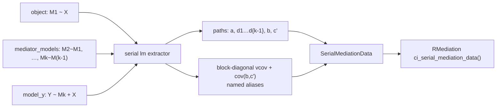

# SPEC: lm/glm Serial Mediation Extractor (medfit Blocker B — item 4)

**Status:** Implemented (feature/lm-serial-extractor, 2026-05-31)
**Created:** 2026-05-31
**Author:** Davood Tofighi (with Claude Code)
**From brainstorm:** `/workflow:brainstorm api save "lm serial extractor"` (2026-05-31)
**Affected repo:** `data-wise/medfit` — `R/extract-lm.R`, `tests/testthat/`
**Closes:** Blocker B acceptance item 4 in
`mediation-planning/specs/MEDFIT-COVARIANCE-EXTRACTION-BLOCKERS-SPEC.md` (decision #2: "lavaan + lm in v1")
**Downstream:** unblocks RMediation v1.5.0 serial CIs for lm/sequential-regression chains (still gated on medfit CRAN)

---

## 0. Why this spec exists

The lavaan serial extractor shipped on `dev` (PR #20, commit `082f1b9`) satisfies 3 of 4 Blocker B
acceptance items. Item 4 remains open: decision #2 of the blockers spec scoped v1 as **lavaan + lm**,
but no **lm/sequential-regression** serial extractor exists — `extract-lm.R` only handles a single
mediator. This spec defines that extractor and, in the same pass, fixes a latent off-diagonal bug in
the existing *simple* lm path.

---

## 1. Overview

Add a **serial branch** to the lm/glm `extract_mediation()` method that constructs a
`SerialMediationData` object from **k + 1 separately-fitted models** for the chain
`X → M1 → M2 → … → Mk → Y`, emitting the same name-based covariance contract as the lavaan serial
extractor (`a`, `d1…d{k-1}`, `b`, `c_prime`). Simultaneously, fix the simple lm extractor so the
`a`/`b`/`c_prime` aliases carry the full within-equation covariance (`cov(b, c')`), not just the
diagonal.

---

## 2. Resolved design decisions (brainstorm 2026-05-31)

1. **Input API — `mediator_models = list(...)`.** Keep a single entry point (honors blockers-spec
   decision #3). `object` = the first mediator model (`M1 ~ X`); the remaining mediator models
   (`M2 ~ M1 + …`, …, `Mk ~ M(k-1) + …`) are passed in order via a new `mediator_models` list arg;
   `model_y` = the outcome model. The serial branch triggers when `length(mediator) >= 2`.
2. **Bug scope — fix both.** Implement the serial path AND fix the simple-lm alias vcov to copy the
   full within-outcome-equation `cov(b, c')` (the lm analogue of Blocker A).
3. **Engine scope — lm + glm.** Mirror the simple path's capability (Gaussian `lm` and `glm`,
   including non-Gaussian families with link-scale paths and family-aware `sigma`).
4. **Spec home — medfit `planning/specs/`** (this file; `docs/` is the gitignored pkgdown output, so
   the tracked `planning/` tree is the correct home). The blockers spec's item 4 should be updated to
   reference it.

---

## 3. Primary user story

**As a** developer fitting a serial mediation chain with separate `lm`/`glm` regressions (the common
"sequential regression" workflow), **I want** `extract_mediation()` to assemble a correctly-named,
covariance-complete `SerialMediationData`, **so that** RMediation (and other consumers) can compute
serial indirect-effect CIs from lm fits, exactly as they already can from a single lavaan fit.

---

## 4. API design

### 4.1 Call shape

```r
extract_mediation(
  m1_fit,                            # object = mediator model 1: M1 ~ X (+ covariates)
  model_y         = y_fit,           # outcome model: Y ~ Mk + X (+ covariates)
  treatment       = "X",
  mediator        = c("M1", "M2"),   # ordered mediator names, length k (>= 2 => serial)
  mediator_models = list(m2_fit)     # mediator models 2..k, in order, length k - 1
)
# -> SerialMediationData
```

- Scalar `mediator` (length 1) → unchanged simple path → `MediationData`.
- Vector `mediator` (length k ≥ 2) → serial path → `SerialMediationData`.
- `mediator_models` is required (and only used) on the serial branch; must have length `k - 1`.

### 4.2 Path resolution

| Path | Source model | Coefficient read |
|------|--------------|------------------|
| `a` | `object` (M1 model) | `coef[treatment]` |
| `d_i` (i = 1…k-1) | `mediator_models[[i]]` (M(i+1) model) | `coef[mediator[i]]` |
| `b` | `model_y` | `coef[mediator[k]]` |
| `c_prime` | `model_y` | `coef[treatment]` (absent ⇒ 0 + warning) |

`d1 = M1→M2`, `d2 = M2→M3`, … — positional labels matching blockers-spec decision #1 and the lavaan
extractor, so RMediation assembles `c("a", paste0("d", seq_len(k-1)), "b")` in product order.

### 4.3 vcov contract (the statistically important part)

The combined `@estimates` is `c(<m1 coefs>, <m2 coefs>, …, <y coefs>)` with prefixes
(`m1_`, `m2_`, …, `y_`) plus named aliases `a`, `d1…d{k-1}`, `b`, `c_prime`. `@vcov` is assembled as:

- **Per-model diagonal blocks**: each model's `vcov()` placed on the block diagonal.
- **Zero cross-model blocks**: paths from different regressions are independent **by construction**
  (sequential regression), so `cov(a, d_i) = cov(d_i, d_j) = cov(d_i, b) = 0`.
- **Within-outcome-equation covariance preserved**: `b` and `c_prime` come from the *same* outcome
  regression, so `cov(b, c_prime)` is non-zero and **must** be copied into the alias block (this is
  the bug fix; see §5).
- **Alias copy = full source row/column** (reuse the lavaan extractor's `resolve_source_idx` pattern),
  not diagonal-only.

> **Documented divergence from lavaan.** For the *same data*, an lm-fit serial chain yields a
> **block-diagonal** chain-path covariance (zero cross-path off-diagonals), whereas a single lavaan
> `sem()` fit yields the **full** covariance. Consequently the serial indirect-effect SE/CI from an
> lm fit will generally differ from (often be tighter than) the lavaan fit. This is correct given the
> different estimators and MUST be stated in the `@details` and the vignette.

### 4.4 Architecture / data flow



---

## 5. The latent simple-lm bug (fixed in this spec)

`extract-lm.R:227–236` copies only the **diagonal** variance onto each of the `a`/`b`/`c_prime`
aliases:

```r
vcov_combined[b_idx, b_idx]  <- vcov_y[mediator, mediator]    # diagonal only
vcov_combined[cp_idx, cp_idx] <- vcov_y[treatment, treatment] # diagonal only
```

`cov(b, c')` (both in the outcome equation) is therefore zeroed for any consumer reading
`vcov[c("b","c_prime"), …]`. `cov(a,b) = 0` is genuinely correct for lm (separate equations), so the
*indirect* effect `a·b` is unaffected — but total-effect and four-way-decomposition consumers read a
wrong (zero) `cov(b, c')`. **Fix:** copy the full source row/column for every alias (same routine the
serial path uses), so the simple and serial lm paths share one correct alias-vcov implementation.

---

## 6. Acceptance criteria

- [x] `extract_mediation(m1_fit, model_y=y_fit, treatment, mediator=c("M1","M2"), mediator_models=list(m2_fit))`
      returns a `SerialMediationData` with `@mediators = c("M1","M2")`, `@d_path` length 1.
- [x] `@estimates`/`@vcov` are named with `a`, `d1…d{k-1}`, `b`, `c_prime`; `@vcov` dim matches
      `@estimates`; matrix is symmetric.
- [x] vcov is block-diagonal across chain paths (`cov(a,d1)=cov(d1,b)=0`) **and** preserves
      `cov(b, c_prime)` from the outcome equation (asserted against `vcov(y_fit)`).
- [x] Works for 2- and 3-mediator chains; works for `glm` outcome and `glm` mediators (link-scale
      paths). `@sigma_mediators` is length-k with `NA` for each non-Gaussian mediator (whole slot
      `NULL` only if all mediators are non-Gaussian); `@sigma_y` `NULL` for non-Gaussian outcome (Q3).
- [x] **Order cross-check (Q2):** `length(mediator_models) == length(mediator) - 1`; for each `i`,
      `mediator[i]` is a predictor in `mediator_models[[i]]` and `mediator[i+1]` is its response;
      `treatment` predicts `mediator[1]` in `object`; `mediator[k]` predicts the response in
      `model_y`. Informative `stop()` on any mismatch (with a test per failure mode).
- [x] Extra covariates in mediator/outcome equations are accepted without warning; `d_i` is read as
      the predecessor-mediator coefficient regardless (Q1) — asserted by a test with `M2 ~ M1 + X`.
- [x] **Simple-lm regression test**: `extract_mediation(m_fit, model_y=y_fit, …)@vcov[c("b","c_prime"),
      c("b","c_prime")]` equals `vcov(y_fit)[c(mediator,treatment), c(mediator,treatment)]`
      (off-diagonal now non-zero).
- [x] `R CMD check` clean; medfit test suite green; `lintr::lint_package()` == 0.
- [x] `@details` + a vignette note document the lm-vs-lavaan covariance divergence (§4.3).

---

## 7. Resolved questions (2026-05-31)

1. **Covariates in mediator equations — DECIDED: document only.** `d_i` = the coefficient of
   `mediator[i]` in `mediator_models[[i]]`, regardless of any additional covariates (X, prior
   mediators, confounders). No restriction and no methodological warning — consistent with medfit's
   "infrastructure, not effect sizes / methodology" principle. Documented in `@details`.
2. **`mediator_models` ordering safety — DECIDED: full cross-check.** For each `i ∈ 1…k-1`, validate
   that (a) `mediator[i]` is a predictor in `mediator_models[[i]]` and (b) `mediator[i+1]` is that
   model's response variable. `stop()` with an informative message on mismatch. Also validate
   `length(mediator_models) == length(mediator) - 1`, that `treatment` predicts `mediator[1]` in
   `object`, and that `mediator[k]` predicts the response in `model_y`. Prevents a mis-ordered list
   silently producing wrong `d`-paths.
3. **glm mediator residual SDs — DECIDED: per-mediator `NA`.** `@sigma_mediators` is a length-k
   vector: the real residual SD for Gaussian mediators, `NA` for non-Gaussian ones. Set the whole
   slot `NULL` only when **all** mediators are non-Gaussian. The `SerialMediationData` validator
   already accepts a length-k vector containing `NA` (its non-negativity check uses `na.rm = TRUE`).

---

## 8. Implications & risks (discussed in brainstorm)

- **API asymmetry is inherent**, not a flaw of this design — lm has no single object holding all
  equations, so `mediator_models` is the least-bad option that keeps one entry point.
- **Two serial code paths** (lavaan + lm) now share the `SerialMediationData` contract; keep the alias
  naming and vcov-copy routine factored so they cannot drift.
- **SE divergence footgun** (§4.3): same data, different CI by engine. Mitigated by loud docs, not by
  code.
- **Scope creep guard**: the simple-lm fix is in-scope (§5) but must not change the indirect-effect
  numbers — only `cov(b,c')` in the alias block; add a regression test pinning the indirect effect.

---

## 9. Out of scope

- Treatment–mediator interaction / four-way decomposition (separate planned class).
- Parallel mediation.
- RMediation-side changes (covered by `RMEDIATION-MEDFIT-COVARIANCE-SPEC.md`).
- medfit CRAN submission (separate ecosystem critical-path item).

---

## 10. Implementation notes

- Add a serial branch in the lm/glm S7 method (and `.extract_mediation_lm_impl`) keyed on
  `length(mediator) >= 2`; factor a `.extract_serial_mediation_lm()` mirroring
  `.extract_serial_mediation_lavaan()`.
- Reuse the `resolve_source_idx` + full-row/column copy pattern from `extract-lavaan.R` for the alias
  vcov (shared helper preferred over duplication).
- New tests file `tests/testthat/test-extract-lm-serial.R` (2-/3-mediator, lm + glm, vcov block
  structure + `cov(b,c')`, validation errors) plus a simple-lm regression test for the bug fix.
- Implement on a `feature/lm-serial-extractor` worktree off `dev`; PR to `dev`.

---

## 11. Review checklist

- [ ] API reviewed (`mediator_models` ergonomics acceptable to maintainer)
- [ ] vcov contract + lm/lavaan divergence agreed
- [x] Simple-lm bug fix confirmed behavior-neutral for indirect effect
      (regression test pins `a·b` unchanged; only `cov(b,c')` changes)
- [x] Acceptance criteria complete and testable (all §6 items covered by tests)
- [x] Open questions resolved before implementation (§7, 2026-05-31)

---

## 12. History

- 2026-05-31 — Initial draft from brainstorm; decisions §2 resolved (input API = `mediator_models`
  list; fix both simple + serial; lm + glm; spec home = medfit `planning/specs/`).
- 2026-05-31 — §7 open questions resolved: (1) covariates = document-only; (2) ordering = full
  cross-check; (3) glm sigma = per-mediator `NA`. Acceptance criteria §6 updated accordingly.
- 2026-05-31 — Implemented on `feature/lm-serial-extractor`. Phase 1: shared
  `.expand_vcov_with_aliases()` helper (`R/utils.R`); simple-lm `cov(b,c')` fix; both lavaan paths
  refactored onto the helper (no drift). Phase 2: `mediator_models` API + `.extract_serial_mediation_lm()`
  worker with full ordering cross-check and per-mediator `NA` sigma. Phase 3: `test-extract-lm-serial.R`
  (2-/3-mediator, lm+glm, vcov block structure + `cov(b,c')`, 5 ordering-error modes, covariate
  tolerance) + `@details`/vignette divergence docs. All §6 acceptance items met; `R CMD check` OK,
  `lintr::lint_package()` == 0.
